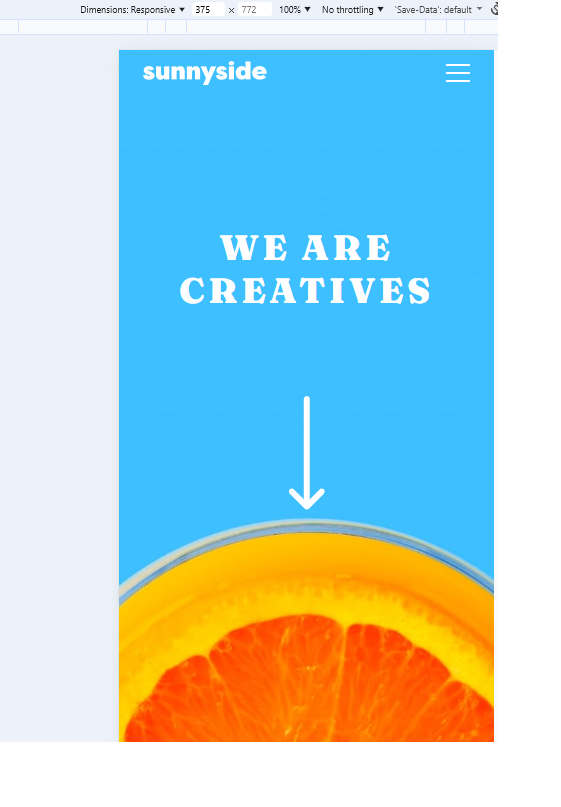
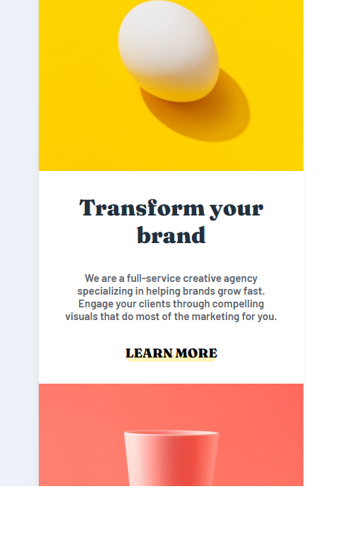
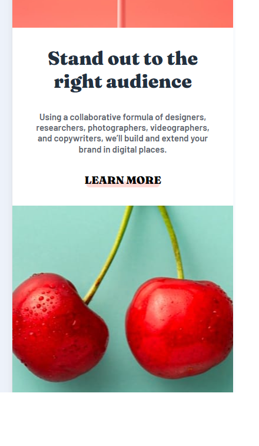
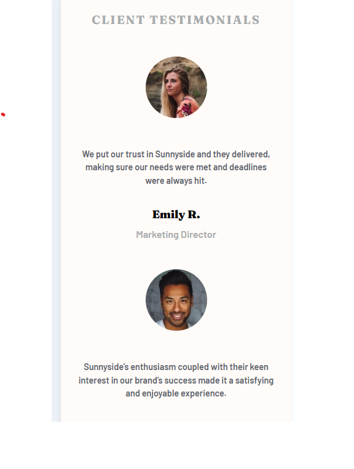
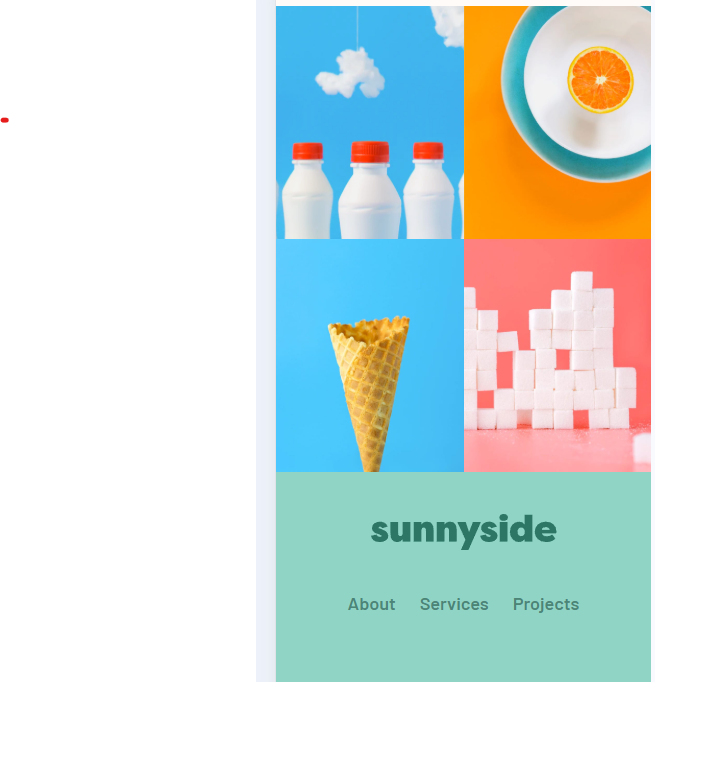

# Sunnyside Agency Landing Page

This is my solution to the Frontend Mentor Sunnyside agency landing page challenge.

## 🔗 Links
- Live Site: https://your-live-site-url.com
- Solution: https://github.com/yourusername/project-name

## 🛠️ Built with
- HTML5
- CSS
- Flexbox
- CSS Grid

## 📸 Screenshot

<!-- Mobile -->

<!-- Desktop -->

## ✨ What I learned

In this project, I learned several new CSS techniques, especially related to advanced selectors and pseudo-elements. One of the key things I understood was how the general sibling selector (`~`) works, for example in `.hero__nav.active ~ .hero__content .hero__arrow`, and how it can be used to control elements based on the state of another element. 

I also learned how the `content: ""` property works in pseudo-elements like `::before` and `::after`, and how it can be used to create additional visual elements without adding extra HTML.

While working on these concepts, I used chatgpt to better understand how and where to apply them. By asking questions and exploring different use cases, I was able to deepen my understanding and apply these techniques more confidently in my project.
## 👤 Author
- GitHub: https://github.com/yourusername